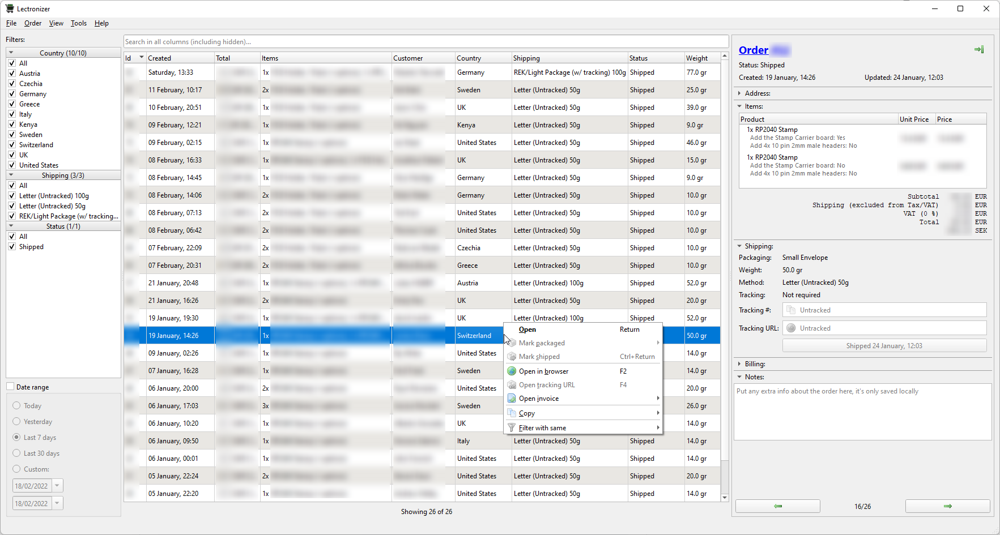

# Lectronizer

A client for the [lectronz.com](https://www.lectronz.com/) maker marketplace.

Still in early development. Many things might not work or be broken.

# Building

The project is written in Qt, tested with Qt 6.2 but should work with other Qt 6 releases and potentially even Qt 5.

You can open the project in Qt Creator and just build it there or from the command line:

    git clone https://github.com/arturo182/lectronizer.git
    cd lectronizer
    qmake .
    make -j

# Credits
- Silk icon set 1.3 by Mark James https://www.famfamfam.com/lab/icons/silk/
- Main app icon: cart by Uniconlabs, motherboard by Chattapat, both from https://www.flaticon.com
